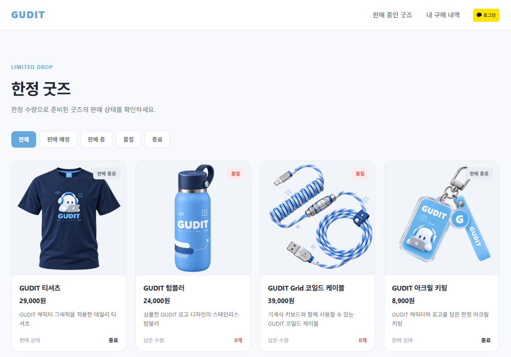
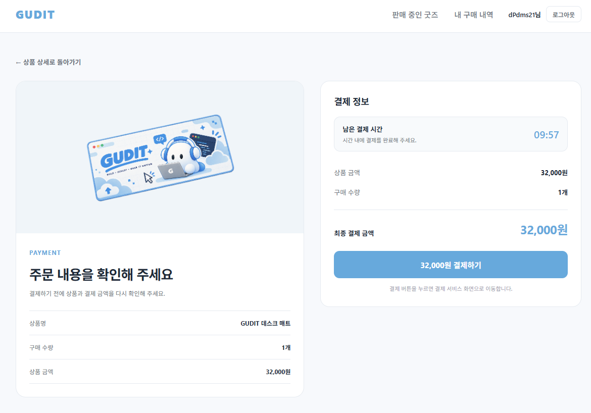
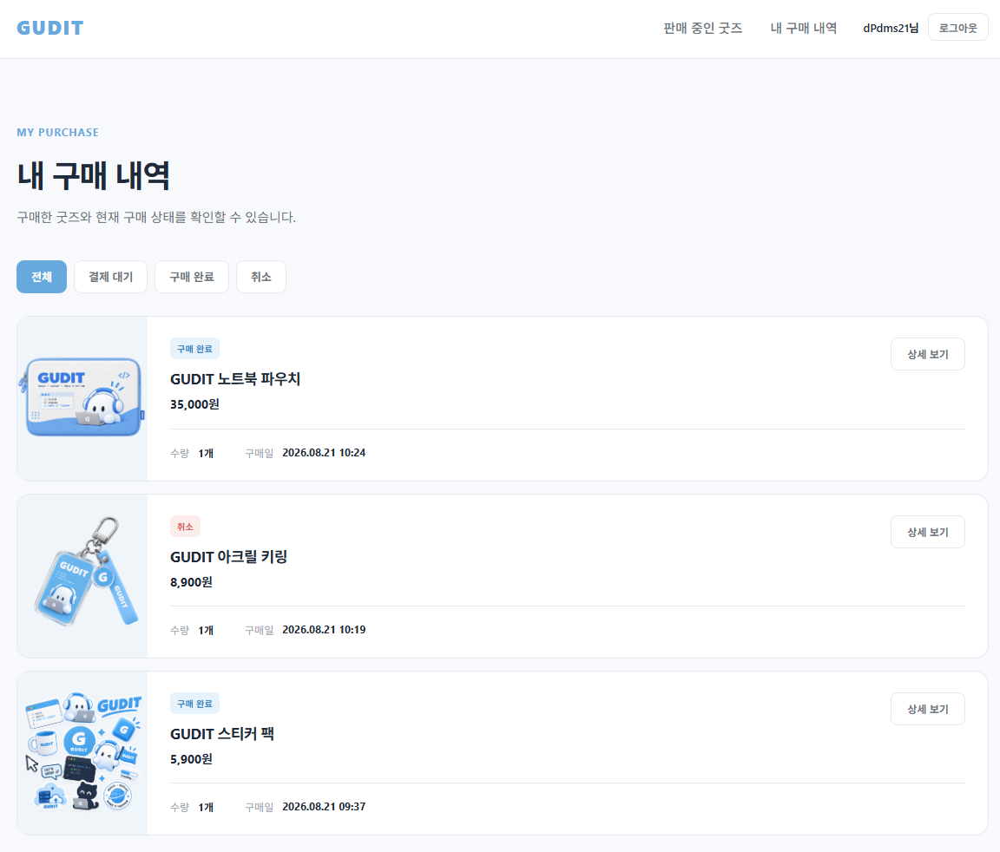
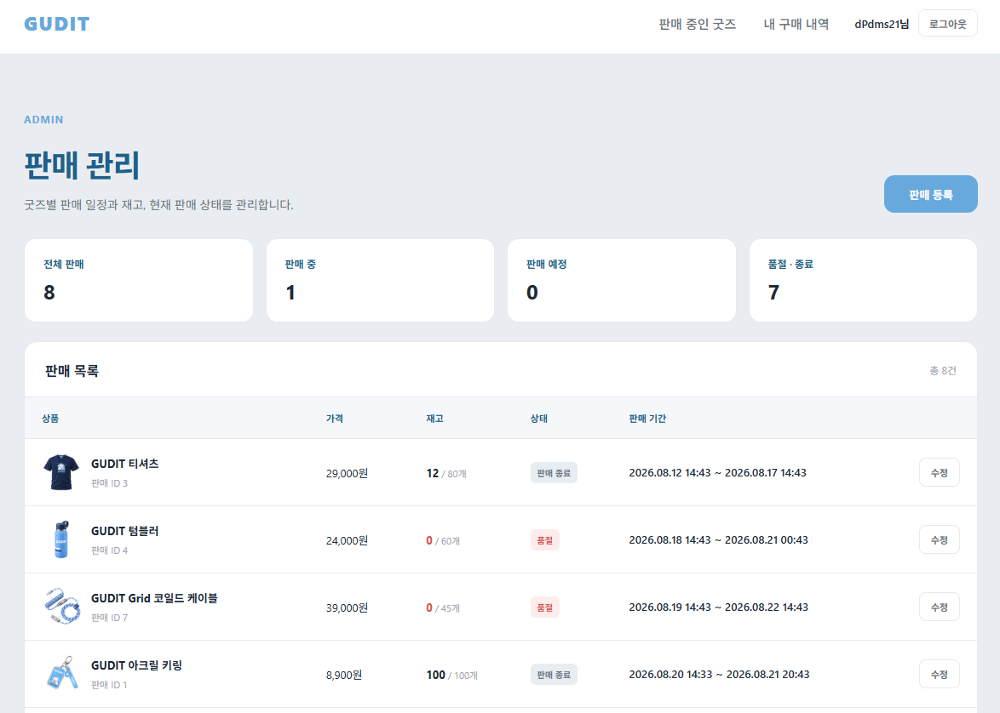

# Gudit v1

> **한정 수량 굿즈의 안정적인 선착순 구매와 결제를 위한 타임세일 서비스**


판매 시작 시 집중되는 구매 요청을 처리하고, 재고·구매·결제 데이터의 정합성을 유지하기 위한 타임세일 서비스이다.

구매·결제 백엔드를 담당하며 동시 결제 승인, 결제·취소 경합, 외부 결제 시스템과 DB 간 정합성 문제를 해결하는 데 집중했다.

본 저장소는 프로그래머스 데브코스 2차 팀 프로젝트의 코드를 개인 포트폴리오용으로 정리한 저장소이다.

| 항목 | 내용 |
| --- | --- |
| 개발 기간 | 2026.08.07 ~ 2026.08.25 |
| 개발 인원 | 3명 |
| 담당 역할 | 구매·결제 백엔드, 프론트엔드, 결제 동시성 테스트 |
| 원본 저장소 | [Gudit 2차 팀 프로젝트](https://github.com/prgrms-be-devcourse/NBE11-13-2-Team03) |
| 후속 프로젝트 | [Gudit v2](https://github.com/dPdms21/gudit-v2) |

---

## 1. Project Overview

### 프로젝트 배경

한정 수량 상품을 판매하는 타임세일 서비스에서는 판매 시작과 동시에 다수의 구매 요청이 집중될 수 있다.

이 과정에서 단순한 구매·결제 API 구현만으로는 다음 문제를 방지하기 어렵다.

* 동시 구매 요청으로 인한 초과 판매 및 구매 수량 제한 위반
* 중복 요청으로 인한 구매·결제 중복 처리
* Redis 재고 차감 이후 DB 저장 실패에 따른 데이터 불일치
* 외부 결제 승인과 내부 구매·결제 상태 간 정합성 문제
* 결제 승인·구매 취소·Timeout 경합으로 인한 상태 충돌

이를 해결하기 위해 Redis 기반 재고 처리와 Toss Payments 결제 흐름을 구축하고, 동시성 및 부하 테스트를 통해 주요 비즈니스 정책을 검증했다.

특히 담당한 구매·결제 도메인에서는 **비관적 락, 트랜잭션 경계 조정, 보상 처리**를 활용해   
동시 요청과 부분 실패 상황에서 데이터 정합성을 유지하는 데 집중했다.

---

## 2. Service Preview & Key Features

### 2.1. Service Preview

| 상품 목록 | 결제 |
| :---: | :---: |
|  |  |
| 판매 상태별 상품 조회 | 주문 정보 확인 및 결제 요청 |

| 구매 내역 | 관리자 판매 관리 |
| :---: | :---: |
|  |  |
| 구매 상태 조회 및 취소 | 판매 일정·재고·상태 관리 |

### 2.2. Key Features

| 구분 | 주요 기능 |
| --- | --- |
| 인증 | Kakao OAuth2 로그인 및 JWT 기반 인증·인가 |
| 상품 | 굿즈 및 타임세일 조회 |
| 구매 | 선착순 구매, 구매 내역 조회, 구매 취소 |
| 결제 | Toss Payments 결제 승인 및 취소 |
| 구매 관리 | 미결제 구매 Timeout 처리 |
| 관리자 | 상품·판매 등록 및 관리, 재고·판매 상태 관리 |
| 재고 | Redis 기반 재고 차감, 구매 수량 제한, 재고 동기화 |

구매 요청 시 재고를 선점하고 구매 정보를 생성하며, 결제 결과에 따라 Purchase와 Payment 상태를 변경하도록 구성했다.

구매 취소 및 결제 실패 시에는 처리 단계에 따라 상태를 보정하고 재고를 복구한다.

---

## 3. My Contributions

**구매·결제 백엔드와 프론트엔드를 담당했으며, 결제 동시성 테스트를 통해 발견한 정합성 문제를 직접 분석하고 개선했다.**

### 3.1. 담당 영역

| 영역 | 주요 구현 및 작업 |
| --- | --- |
| Purchase | 구매 생성·조회·취소, 구매 상태 관리, 재고 도메인 연동 |
| Payment | Toss 결제 승인·취소, 상태 전이, 중복 승인 방지, 보상 취소 |
| Payment Webhook | 결제 상태 재조회 및 보정, 중복 요청 대응, 역직렬화 오류 해결 |
| Concurrency | Payment 비관적 락, Deadlock 원인 분석 및 락 획득 순서 통일 |
| Testing | k6 결제 동시성 시나리오 구현, 테스트 스크립트 오류 분석, 회귀 검증 |
| Frontend | Thymeleaf 기반 사용자·관리자 화면 구현 및 API 연동 |

### 3.2. 주요 문제 해결 성과

| 문제                        | 개선 결과                                                            |
| -------------------------- | ------------------------------------------------------------------- |
| 동시 결제 승인 중복 처리      | 동일 Payment 승인 요청 50건 중 성공 응답 10건 → 1건                      |
| 결제 승인·취소 Deadlock     | 락 획득 순서 통일 후 Scenario 07에서 Deadlock 미발생 및 검증 항목 100% 통과 |
| DB 롤백 시 Redis 재고 불일치 | DB 커밋 성공 이후에만 Redis 재고를 복구하도록 처리 시점 변경                |
| Toss Webhook 역직렬화 오류  | 날짜 타입 수정 후 신규·재전송 요청에서 HTTP 200 확인                       |

위 결과는 특정 테스트 환경에서 수행한 검증 결과이며, 운영 환경의 처리 용량을 의미하지 않는다.

### 3.3. 팀 내 역할 구분

| 팀원 | 담당 영역 |
| --- | --- |
| 박예은 | 구매·결제, 프론트엔드, 결제 동시성 테스트, 발표 자료 |
| 신창석 | 인증·인가, 공통 예외 처리, Swagger, k6 테스트 |
| 정진협 | 상품·판매·재고, 재고 동시성 테스트, 발표 |

Redis 재고 관리와 Lua Script는 재고 담당 팀원이 구현했다.

미결제 구매 Timeout 스케줄러 역시 다른 팀원이 구현했으며, 구매·결제 도메인에서는 해당 기능과 연동되는 상태 관리 및 동시성 문제를 고려했다.

---

## 4. Tech Stack

| 구분 | 기술 |
| --- | --- |
| Language | Java 25 |
| Backend | Spring Boot 4.1.0, Spring MVC, Spring Data JPA |
| Security | Spring Security, Kakao OAuth2, JWT |
| Database | PostgreSQL |
| Inventory | Redis, Lua Script |
| Payment | Toss Payments |
| Testing | JUnit, k6 |
| Frontend | Thymeleaf, HTML, CSS, JavaScript |
| Infrastructure | Docker, Docker Compose |
| API Documentation | Springdoc OpenAPI, Swagger |
| Build | Gradle |

---

## 5. System Architecture & Design

### 5.1. System Architecture


서비스는 Spring Boot 기반 애플리케이션에서 사용자·관리자 요청을 처리하도록 구성했다.

주요 시스템의 역할은 다음과 같다.

| 구성 요소 | 역할 |
| --- | --- |
| Spring Boot | 인증·상품·판매·구매·결제 API 및 웹 화면 제공 |
| PostgreSQL | 상품·판매·구매·결제 영속 데이터 저장 |
| Redis | 실시간 재고 및 사용자별 구매 수량 관리 |
| Kakao OAuth2 | 사용자 인증 |
| Toss Payments | 외부 결제 승인 및 취소 |

Redis는 실시간 재고를 처리하고, PostgreSQL은 구매·결제 상태를 영속적으로 관리한다.

외부 결제 시스템과 내부 DB는 하나의 트랜잭션으로 묶을 수 없으므로, 결제 결과에 따른 별도의 상태 보정 및 보상 처리를 구성했다.

### 5.2. ERD


구매와 결제는 별도의 도메인으로 관리한다.

Purchase는 구매 진행 상태를, Payment는 외부 결제 처리 상태를 관리하며, 두 상태는 결제 승인과 취소 과정에서 함께 변경된다.

### 5.3. 구매·결제 상태 모델

**Purchase**

```text
PENDING_PAYMENT
    ├── PURCHASED
    └── CANCELED
```

| 상태 | 의미 |
| --- | --- |
| PENDING_PAYMENT | 구매 생성 후 결제 대기 |
| PURCHASED | 결제 완료 및 구매 확정 |
| CANCELED | 구매 취소 |

**Payment**

```text
READY
  ├── IN_PROGRESS
  │       ├── DONE
  │       └── FAILED
  └── CANCELED

DONE → CANCELED
```

| 상태 | 의미 |
| --- | --- |
| READY | 결제 준비 |
| IN_PROGRESS | 결제 승인 처리 중 |
| DONE | 결제 완료 |
| FAILED | 결제 실패 |
| CANCELED | 결제 취소 |

구매와 결제의 상태를 분리함으로써 외부 결제 승인과 내부 구매 확정 과정을 구분했다.

상태 변경 시 현재 상태를 검증하고, 허용되지 않는 상태 전이를 차단하도록 구성했다.

---

## 6. Core Backend Implementation

### 6.1. 선착순 구매 처리

재고 담당 도메인과 연동해 구매 생성부터 결제 대기 상태까지의 흐름을 구현했다.

구매 요청 시 판매 상태와 구매 가능 여부를 검증하고, 재고 선점 결과에 따라 Purchase를 생성한다.

```text
구매 요청
   ↓
판매 상태 및 구매 가능 여부 검증
   ↓
재고 도메인에 선점 요청
   ↓
Purchase 생성
   ↓
PENDING_PAYMENT
```

구매 도메인에서는 구매 생성·조회·취소, Purchase 상태 전이, 중복 요청 및 취소 가능 여부 검증을 담당했다.

재고 선점 이후 DB 저장에 실패하는 경우를 고려해 구매 처리 결과에 따른 보상 흐름도 구성했다.

Redis 재고 관리와 Lua Script는 재고 담당 팀원이 구현했으며, 구매 도메인에서는 해당 기능과 연동되는 비즈니스 로직을 담당했다.

### 6.2. Toss Payments 결제 처리

결제 승인 과정은 Payment 상태 검증, Toss 승인 요청, 내부 상태 변경으로 구분했다.

```text
결제 승인 요청
   ↓
Payment 상태 검증
   ↓
Payment = IN_PROGRESS
   ↓
Toss Payments 승인 요청
   ↓
결제 결과 확인
   ↓
내부 결제 완료 처리
   ↓
Payment = DONE
Purchase = PURCHASED
```

외부 결제 승인과 내부 DB 상태 변경을 분리하고, 결제 결과에 따라 Purchase와 Payment 상태를 관리하도록 구성했다.

중복 승인 및 외부 승인 이후 내부 처리 실패와 관련한 상세 대응 과정은 Technical Challenges에서 설명한다.

### 6.3. 구매 취소 및 Webhook 상태 보정

구매 취소 시 현재 Purchase·Payment 상태를 확인하고, 결제 완료 여부에 따라 Toss 결제 취소와 내부 상태 변경을 수행한다.

재고 복구가 필요한 경우 재고 도메인과 연동하며, Toss Webhook을 통해 전달된 결제 상태를 기준으로 내부 상태를 보정하도록 구현했다.

Webhook에서는 결제 완료·취소·중단·만료 상태와 중복 요청을 처리하며, 현재 상태를 기준으로 허용되는 상태 변경만 수행한다.

구체적인 동시성 문제와 실패 처리 과정은 Technical Challenges에서 설명한다.

---

## 7. Technical Challenges

### 7.1. 동시 결제 승인으로 인한 중복 처리 방지

#### 문제 상황

동일한 Payment에 결제 승인 요청 50건을 동시에 전송하는 k6 테스트를 수행했다.

최초 테스트에서는 10건이 성공하고 40건이 실패했다. 동일한 결제에 대해 여러 요청이 성공할 수 있어 중복 승인 방지가 필요했다.

#### 원인 분석

기존 로직은 Purchase에 비관적 락을 적용했지만, Payment를 조회하고 상태를 검증하는 과정에는 별도의 잠금이 없었다.

이에 따라 여러 요청이 동일한 `READY` 상태를 확인하고 승인 흐름에 진입할 수 있었다.   
Purchase에 대한 잠금만으로는 Payment의 상태 확인과 변경을 보호하기 어려웠다.

#### 해결 과정

**1. Payment 비관적 락 적용**

동일 Payment에 동시 요청이 집중되어 충돌 가능성이 높고, 결제 승인은 충돌을 사후 감지하기보다 중복 처리 진입 자체를 제어할 필요가 있다고 판단했다.   
따라서 `@Version` 기반 낙관적 락보다 조회 시점부터 row lock을 획득해 요청을 직렬화하는 `PESSIMISTIC_WRITE`를 적용했다.

`PaymentRepository`에 `PESSIMISTIC_WRITE` 기반 잠금 조회 메서드를 추가했다.

```java
findByOrderIdWithLock()
```

`startPayment()`에서 Payment를 잠금 조회하도록 변경하고, 락을 획득한 상태에서 현재 상태를 검증하도록 구성했다.

**2. 첫 번째 수정 이후 발생한 오류 분석**

Payment 비관적 락 적용 후 테스트를 재실행했으나, 성공 1건·예상 거절 1건·비정상 응답 48건으로 일부 요청에서 `COMMON_500`이 발생했다.

처리 흐름을 확인한 결과, `startPayment()`와 `completePayment()`의 락 획득 순서가 일관되지 않은 문제를 발견했다.

또한 성능 테스트 fixture의 판매 상태가 `READY`여서 판매 가능 상태 검증이 실패하는 문제를 확인하고, PR #23의 `ON_SALE` 변경 사항을 반영했다.

**3. 락 획득 순서 통일**

두 처리 흐름의 락 획득 순서를 다음과 같이 통일했다.

```text
Payment Lock
     ↓
Purchase Lock
     ↓
상태 검증 및 변경
```

락 획득 이후 현재 상태를 다시 검증하고, 이미 처리 중이거나 처리가 완료된 요청은 거절하도록 구성했다.

중복 요청은 처리 시점에 따라 `PAYMENT_006` 또는 `PURCHASE_004`로 거절될 수 있으므로 두 응답을 예상 거절로 분류했다.

#### 검증 결과

동일 Payment에 승인 요청 50건을 전송한 결과는 다음과 같다.

| 지표       | 개선 전 | 개선 후 |
| -------- | ---: | ---: |
| 승인 성공 응답 |  10건 |   1건 |
| 중복 성공 응답 |   9건 |   0건 |
| 정상 거절    |   0건 |  49건 |
| 예상 밖 응답  |  40건 |   0건 |

최종 데이터 상태도 함께 확인했다.

| 검증 항목       | 결과        |
| ----------- | --------- |
| Purchase    | PURCHASED |
| Payment     | DONE      |
| Redis 잔여 재고 | 99        |
| p95 응답시간    | 1.71초     |
| 목표 p95      | 2초        |

Payment 비관적 락 적용과 `Payment → Purchase` 락 획득 순서 통일 후, 동시 승인 요청 50건 중 1건만 성공하고 나머지 49건이 정상 거절됐다.

중복 성공 및 예상 밖 응답은 발생하지 않았으며, 최종 Purchase·Payment·Redis 재고 상태가 일치했다. p95 응답시간도 1.71초로 목표인 2초를 만족했다.

---

### 7.2. 결제 승인·취소 경합에서 발생한 Deadlock 및 Redis 재고 불일치 개선

#### 문제 상황

동일한 Purchase에 결제 승인과 구매 취소 요청을 동시에 실행했을 때 취소 요청에서 HTTP 500 오류가 발생했다.

로그에서 다음 오류를 확인했다.

```text
LockAcquisitionException
PostgreSQL: deadlock detected
```

실패 이후 최종 데이터 상태는 다음과 같았다.

| 데이터 | 상태 |
| --- | --- |
| Purchase | PURCHASED |
| Payment | DONE |
| Redis 재고 | 100 |

DB에서는 결제가 완료된 상태였지만 Redis 재고는 취소된 것처럼 복구되어 데이터 불일치가 발생했다.

#### 원인 분석

문제는 두 가지 원인으로 구분됐다.

**원인 1. 락 획득 순서 불일치**

결제 승인과 구매 취소의 락 획득 순서가 서로 달랐다.

```text
결제 승인               구매 취소

Payment Lock           Purchase Lock
     ↓                      ↓
Purchase Lock          Payment Lock
     ↓                      ↓
           Deadlock
```

각 트랜잭션이 상대방이 보유한 락의 해제를 기다리는 순환 대기가 발생했다.

**원인 2. DB 커밋 이전 Redis 재고 복구**

구매 취소 과정에서 DB 트랜잭션이 완료되기 전에 Redis 재고 복구를 수행하고 있었다.

Redis 변경은 DB 트랜잭션의 롤백 대상에 포함되지 않는다.

따라서 Redis 재고 복구 이후 DB 트랜잭션이 Deadlock으로 롤백되면 DB는 기존 상태를 유지하지만 Redis에는 복구된 재고가 남게 된다.

#### 해결 과정

**1. 락 획득 순서 통일**

`PaymentRepository`에 다음 잠금 조회 메서드를 추가했다.

```java
findByPurchaseIdWithLock()
```

구매 취소에서도 Payment를 먼저 잠금 조회하도록 변경했다.

결제 승인과 구매 취소 모두 다음 순서로 락을 획득하도록 통일했다.

```text
Payment Lock
     ↓
Purchase Lock
     ↓
상태 검증 및 변경
```

**2. Redis 재고 복구 시점 변경**

기존에는 DB 트랜잭션 내부에서 Redis 재고를 즉시 복구했다.

이를 DB 커밋 성공 이후 `afterCommit()`에서 재고 복구를 수행하도록 변경했다.

```text
DB 상태 변경
    ↓
Transaction Commit
    ↓
afterCommit()
    ↓
Redis 재고 복구
```

DB 트랜잭션이 롤백된 경우에는 재고 복구가 실행되지 않도록 처리했다.

**3. 테스트 환경 보완 및 회귀 검증**

결제 완료 후 취소하는 performance 환경에서 실제 Toss API를 호출하지 않도록 Toss 취소 Stub을 추가했다.

Scenario 07을 재실행한 뒤 기존 Scenario 06도 다시 실행해 중복 승인 방지 로직에 회귀가 발생하지 않았는지 확인했다.

#### 검증 결과

| 항목 | 개선 후 |
| --- | --- |
| Scenario 07 checks | 100% 통과 |
| Deadlock | 미발생 |
| HTTP 500 | 미발생 |
| Purchase | CANCELED |
| Payment | CANCELED |
| Redis 재고 | 100 |

Scenario 06 회귀 테스트에서도 다음 결과를 확인했다.

- 승인 성공 1건
- 정상 거절 49건
- Purchase `PURCHASED`
- Payment `DONE`
- Redis 잔여 재고 99개

락 획득 순서를 `Payment → Purchase`로 통일하고 Redis 재고 복구 시점을 DB 커밋 이후로 변경했다.   
Scenario 07 재실행에서 Deadlock과 HTTP 500이 재현되지 않았으며, 모든 검증 항목이 통과했다.   
최종 Purchase·Payment·Redis 재고 상태도 일치했다.

#### 남은 한계

`afterCommit()`으로 복구 시점을 이동하면 DB 롤백 이후 Redis가 잘못 변경되는 문제는 방지할 수 있다.

그러나 DB 커밋 이후 Redis 복구 자체가 실패하는 경우까지 해결되는 것은 아니다.

이미 DB 트랜잭션은 완료됐으므로 Redis 복구 실패에 대응할 별도의 재처리 수단이 필요하다.

이 문제는 후속 프로젝트에서 Transactional Outbox를 도입하는 계기가 됐다.

---

### 7.3. Toss 승인 성공 후 DB 처리 실패에 대한 보상 트랜잭션

#### 문제 상황

Toss Payments의 결제 승인과 내부 DB 상태 변경은 하나의 트랜잭션으로 처리할 수 없다.

Toss 승인은 성공했지만 Purchase·Payment 완료 처리에 실패하면 실제 결제와 내부 상태가 불일치할 수 있다.

#### 해결 과정

- Toss 승인과 내부 DB 상태 변경의 트랜잭션 경계를 분리했다.
- 외부 승인 이후 내부 처리에 실패하면 Toss 보상 취소를 요청하고, 승인 결과가 불명확한 경우 결제 상태를 재조회하도록 구성했다.
- 주문번호 기반 멱등성 키와 상태 검증을 통해 중복 승인 요청에 대응했다.

#### 결과 및 한계

외부 승인 이후 내부 처리 실패 시 보상 취소를 시도할 수 있도록 구성했다.

다만 보상 취소 자체가 실패하면 이를 영속적으로 기록하고 자동 재처리할 수단이 부족했으며, 이 한계는 후속 프로젝트의 복구 구조 개선으로 이어졌다.

---

### 7.4. Toss Webhook 역직렬화 오류 및 상태 보정

#### 문제 상황

Toss Webhook의 `createdAt`에는 시간대 오프셋이 없었지만 DTO에서 `OffsetDateTime`으로 역직렬화해 HTTP 500이 발생했다.

#### 해결 과정

실제 Webhook 형식을 확인한 뒤 DTO 타입을 `LocalDateTime`으로 변경했다.

또한 Webhook 수신 시 Toss 결제 상태를 재조회하고, 현재 Purchase·Payment 상태를 기준으로 허용되는 변경만 반영하도록 구성했다.

#### 결과

신규 및 재전송 Webhook 요청에서 HTTP 200 응답을 확인했으며, 중복 Webhook과 결제 상태 보정 흐름을 처리할 수 있도록 개선했다.

---

### 7.5. k6 부하 테스트 환경 문제 분석

#### 문제 상황

재고 100개를 대상으로 1,000 VU 선착순 구매 테스트를 수행했을 때 Windows 로컬 환경에서 다수의 `Connection refused`가 발생했다.

최초 결과는 구매 성공 100건, 정상 품절 254건, 비정상 응답 646건이었다.

#### 분석 과정

VU를 단계적으로 변경하고 Tomcat 설정, `bootRun`과 jar 실행 방식을 비교했지만 연결 오류는 계속 발생했다.

또한 테스트 스크립트를 확인한 결과 TCP 연결 실패가 일반적인 요청 실패와 구분되지 않고 있어,   
애플리케이션 처리 오류와 테스트 환경 오류를 분리해 분석하도록 수정했다.

동일한 1,000 VU 시나리오를 Mac 환경에서 실행한 결과 구매 성공 100건, 정상 품절 900건, 비정상 응답 0건을 확인했다.

#### 결과 및 한계

Windows 로컬 환경의 TCP 연결 문제가 결과에 영향을 미쳤을 가능성을 확인했지만,   
실행 환경 외의 모든 변수를 통제한 실험은 아니므로 정확한 원인으로 단정하지 않았다.

향후 부하 발생기와 애플리케이션을 분리한 환경에서 재검증할 필요가 있다.

---

## 8. Testing & Performance

k6를 활용해 실제 동시 요청 상황을 재현하고, HTTP 응답뿐 아니라 최종 DB·Redis 상태까지 확인했다.

### 8.1. 테스트 환경 및 검증 기준

| 항목 | 내용 |
| --- | --- |
| 테스트 도구 | k6 |
| 데이터베이스 | PostgreSQL |
| 재고 저장소 | Redis |
| 결제 외부 연동 | performance 프로필의 Toss Stub |
| 주요 검증 대상 | Purchase, Payment, Redis 재고 |

테스트에서는 다음 항목을 함께 확인했다.

- 예상 성공 및 정상 거절 건수
- 예상하지 못한 HTTP 응답
- 구매·결제 최종 상태
- Redis 최종 재고
- 중복 승인 및 중복 재고 복구 여부
- p95 응답시간 및 연결 오류

결제 동시성 테스트를 위해 Scenario 06·07의 Purchase·Payment fixture를 분리하고, 기존 자동 실행 및 데이터 초기화 스크립트를 확장했다.

### 8.2. 팀 전체 동시성 테스트

팀에서는 재고·구매·결제에 대한 총 7개 동시성 시나리오를 구성했다.

| 시나리오 | 검증 대상 |
| --- | --- |
| 재고 초과 구매 | 재고 수량 초과 판매 방지 |
| 단일 판매 집중 | 다수 구매 요청 처리 |
| 분산 판매 | 여러 판매에 대한 재고 정합성 |
| 중복 구매 | 동일 사용자의 중복 구매 방지 |
| 구매 취소 | 중복 취소 및 재고 중복 복구 방지 |
| 결제 승인 | 동일 Payment 중복 승인 방지 |
| 승인·취소 경합 | 구매·결제·재고 최종 상태 일치 |

개선 전후 각각 3회씩 총 42회 실행해 주요 비즈니스 조건을 검증했다.

재고 도메인의 Lua Script 구현 및 재고 동시성 테스트는 재고 담당 팀원이 수행했다.  
결제 승인 및 승인·취소 경합 시나리오(06·07)는 직접 담당했다.

### 8.3. 성능 검증의 한계

팀 전체 부하 테스트에서는 판매 목록 조회의 N+1 문제를 개선했으나, 모든 성능 목표를 충족한 것은 아니었다.

- Stress 목록 조회 p95: 2.77초로 목표 2초 미충족
- Spike 목록 조회 p95: 3.37초로 목표 3초 미충족
- `dropped_iterations`가 남아 있어 안정적인 500 RPS 처리 능력은 입증하지 못함

또한 1,000 VU 동시성 테스트 통과가 실제 운영 환경에서 1,000명의 사용자를 안정적으로 처리할 수 있다는 의미는 아니다.

테스트 환경과 서버 자원을 분리하고, 응답시간·에러율·처리량을 동일 조건에서 재측정할 필요가 있다.

---

## 9. Limitations & Evolution

### 9.1. 2차 프로젝트의 구조적 한계

2차에서는 Redis 재고, PostgreSQL의 구매·결제 상태, Toss Payments를 하나의 트랜잭션으로 묶을 수 없어 실패 상황에 대한 보상 처리를 구현했다.

다만 DB 커밋 이후 Redis 복구 실패나 외부 결제 보상 취소 실패를 영속적으로 기록하고 자동 재처리할 구조는 부족했다.

### 9.2. Gudit v2 — 후속 개선

2차에서 확인한 정합성 문제를 바탕으로 3차 프로젝트에서 장애 복구 구조를 개선했다.

| 2차 프로젝트의 한계 | 3차 프로젝트의 개선 |
| --- | --- |
| DB 커밋 이후 Redis 복구 실패 가능 | Transactional Outbox 기반 복구 요청 기록 |
| 복구 요청 재처리 수단 부족 | Redis Streams 기반 이벤트 처리 및 재처리 |
| 이벤트 중복 소비 가능성 | 이벤트 멱등 처리 |
| 외부 결제 보상 실패 시 재처리 한계 | 보상 요청의 이벤트 기반 처리 |

3차 프로젝트에서는 구매·결제 도메인을 담당하며 Outbox와 Redis Streams를 활용한 복구 흐름 및 Kotlin 전환 작업을 진행했다.

2차에서 발견한 문제를 단발성 수정으로 끝내지 않고, 후속 프로젝트의 구조 개선으로 연결했다.

---

## 10. Getting Started

### 10.1. Requirements

- JDK 25
- Docker 및 Docker Compose
- Kakao OAuth2 애플리케이션 정보
- Toss Payments 테스트 키

### 10.2. Clone Repository

```bash
git clone https://github.com/dPdms21/gudit-v1.git
cd gudit-v1
```

### 10.3. Environment Variables

실행에 필요한 환경변수는 `src/main/resources/application.yaml` 및 Docker Compose 설정을 참고해 구성한다.

주요 설정 항목은 다음과 같다.

```text
Kakao OAuth2 Client ID / Secret
JWT Secret
Toss Payments Client Key / Secret
Database Connection
Redis Connection
```

실제 인증 정보와 API Key는 저장소에 커밋하지 않는다.

Spring Boot 실행 환경에는 필요한 환경변수를 별도로 전달해야 하며,   
Docker Compose에서 사용하는 `.env` 파일이 Spring Boot 애플리케이션에 자동으로 전달되는 것은 아니다.

### 10.4. Run

PostgreSQL 및 Redis를 실행한다.

```bash
docker compose up -d
```

애플리케이션을 실행한다.

```bash
./gradlew bootRun
```

Windows에서는 다음 명령어를 사용한다.

```powershell
.\gradlew.bat bootRun
```

### 10.5. Test

```bash
./gradlew test
```

> 개발 환경에서 JPA `ddl-auto: create`와 초기 데이터 SQL을 사용하는 경우   
> 기존 데이터가 변경될 수 있으므로 별도의 테스트용 DB를 사용해야 한다.

---

## 11. References

### Related Repositories

| Repository | Description |
| --- | --- |
| [Gudit 2차 팀 저장소](https://github.com/prgrms-be-devcourse/NBE11-13-2-Team03) | 최초 기능 구현 및 동시성 검증 |
| [Gudit v1](https://github.com/dPdms21/gudit-v1) | 2차 프로젝트 개인 포트폴리오 |
| [Gudit 3차 팀 저장소](https://github.com/prgrms-be-devcourse/NBE11-13-3-Team03) | Outbox·Redis Streams 및 Kotlin 전환 |
| [Gudit v2](https://github.com/dPdms21/gudit-v2) | 3차 프로젝트 개인 포트폴리오 |

### Author

**박예은 | Yeeun Park**

Backend Developer

GitHub: [dPdms21](https://github.com/dPdms21)
